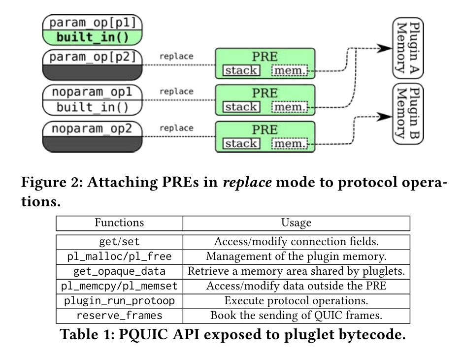

# [Paper] Pluginizing QUIC

We propose Pluginized QUIC (PQUIC), a framework that enables QUIC clients and servers to dynamically exchange protocol plugins that extend the protocol on a per-connection basis.

# Contributions

- We design a technique where an extension to the QUIC protocol is broken down in a protocol plugin which can be dynamically attached to an existing implementation. These plugins interact with this implementation through code which is dynamically inserted at specific locations called protocol operations.
- We propose a safe and scalable technique that enables the on-demand exchange of protocol plugins over QUIC connections. This solves the deployment problem of existing protocol extensions.
- We implement a prototype of Pluginized QUIC (PQUIC) by extending picoquic [48], one of the most complete implementations of IETF QUIC [76]. We add to picoquic a virtual machine that allows executing the bytecode of protocol plu- gins in a platform independent manner while monitoring their behavior.
- We demonstrate the benefits of PQUIC through plugins that add new monitoring capabilities, support for Multipath QUIC [19], the Unreliable Datagram Extension [75] and several Forward Erasure Correction techniques.

# LOCAL PLUGIN INSERTION

## Pluglet Runtime Environment (PRE)

PQUIC executes plugins inside a lightweight virtual machine (VM).

In this paper, our Pluglet Runtime Environment (PRE) relies on a user-space implementation [49] of the eBPF VM [30].

### Security

First, our PRE checks simple properties of the bytecode to ensure its (apparent) validity. This includes checking that: 

- (i) the bytecode contains an exit instruction, 
- (ii) all instructions are valid (known opcodes and values), 
- (iii) the bytecode does not contain trivially wrong opera- tions (e.g., dividing by zero), 
- (iv) all jumps are valid, and 
- (v) the bytecode never writes to read-only registers. Furthermore, our PRE statically verifies the validity of stack accesses.

A plugin is rejected if any of the above checks fails for one of its pluglets.

Second, our PRE monitors the correct operation of the pluglets by injecting specific instructions when their bytecode is JITed.

These monitoring instructions check that the memory accesses operate within the allowed bounds. To achieve this, we add a register to the VM that cannot be used by pluglets. This register is used to check that the memory accesses performed by a pluglet remain within either the plugin dedicated memory or the pluglet stack. Any violation of memory safety results in the removal of the plugin and the termination of the connection.

## Protocol Operations

Protocol operations are split into three anchors, each of which is a possible insertion point for a pluglet. Protocol operations with parameters propose a specific set of anchors for each parameter value.

The **first anchor**, called replace, consists of the actual implementation of the operation. This part is usually provided by the original PQUIC function. This mode enables a pluglet to override the default behavior. Because it may modify the connection context, at most one pluglet can replace a given protocol operation. If a second one tries to replace the same operation, it will be rejected and the plugin it belongs to will be rolled back.

The **two other anchors**, pre and post, attach the plugin just before (resp. just after) the protocol operation invocation. These modes are similar to the eBPF kprobes in the Linux kernel [55]. By default, those are no-ops in PQUIC.

Unlike the replace anchor, any number of pre and post pluglets can be inserted for a given protocol operation. However, they only have read access to the connection context and the operation arguments and outputs. The only write accesses they have is to their pluglet stack and their plugin-specific memory.

## Attaching Protocol Plugins

A PRE is created for each inserted pluglet. Each PRE contains its own registers and stack.

PQUIC exposes some functions to the PRE

### Major Operations

- Exposing connection fields through getters and setters.
- Managing plugin memory.
- Retrieving data shared by pluglets.
- Modifying connection memory area.
- Calling other protocol operations.
- Scheduling the transmission of QUIC frames.

## Interacting with Applications

The external mode is similar to the replace mode, but it makes the protocol operation only executable by the application.

This allows it to directly invoke new methods, e.g. queuing a message to be sent. Second, a plugin can asynchronously push messages back to the application, so that it remains independent of the application control flow.

## Reusing Plugins across Connections

Local cache of plugins.

