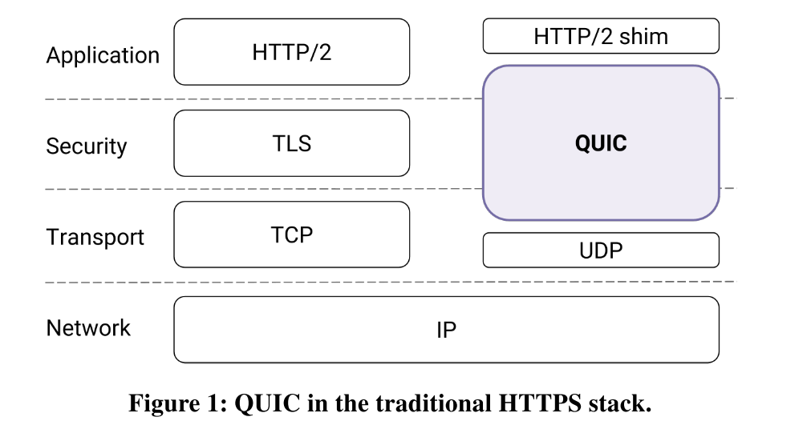
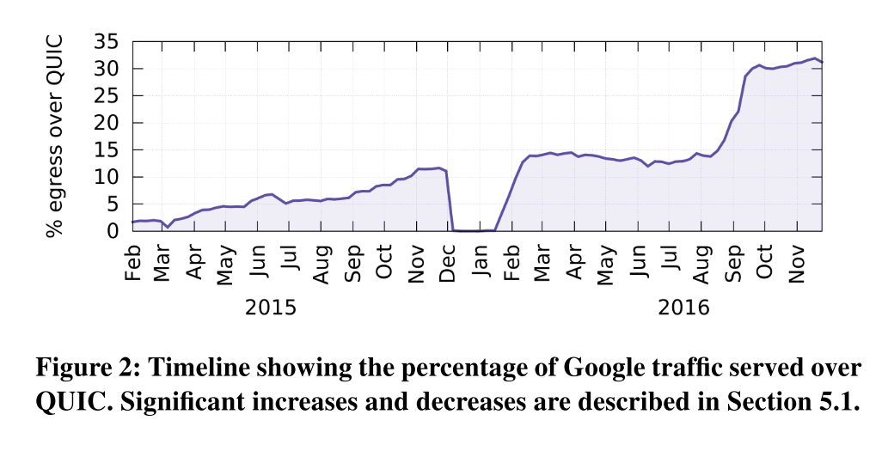
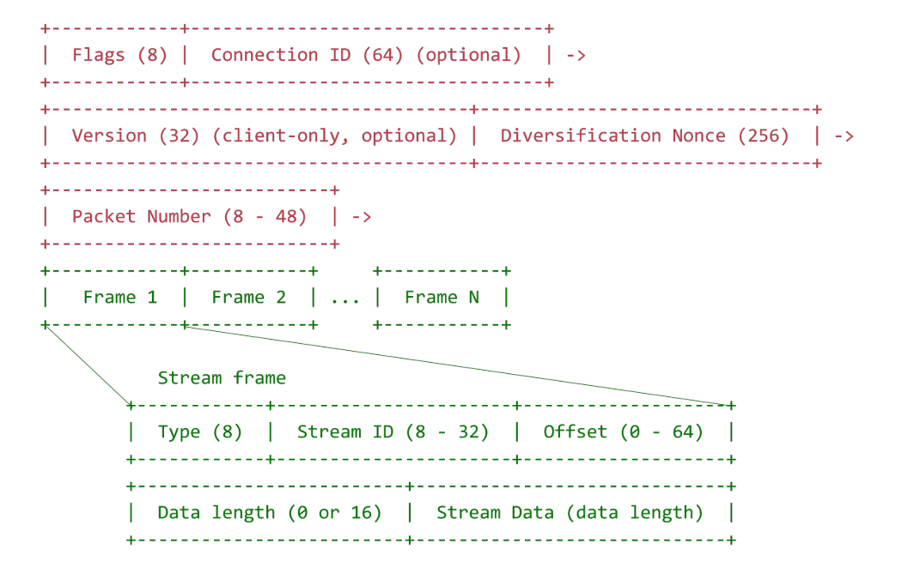

# [Paper] The QUIC Transport Protocol- Design and Internet-Scale Deployment

Nov. 12, 2019

QUIC is an encrypted transport: packets are authenticated and encrypted, preventing modification and limiting ossification of the protocol by middleboxes.

# Introduction

As the author said the QUIC protocol is **"an encrypted, multiplexed, and low-latency transport protocol designed from the ground up to improve transport performance for HTTPS traffic and to enable rapid deployment and continued evolution of transport mechanisms."**

We present QUIC (Quick Udp Internet Connection), **a new transport designed from the ground up to improve performance for HTTPS traffic and to enable rapid deployment and continued evolution of transport mechanisms.** QUIC replaces most of the traditional HTTPS stack: HTTP/2, TLS, and TCP (Figure 1). We developed QUIC as a user-space transport with UDP as a substrate.

## Current deploy progress

QUIC has been globally deployed at Google on thousands of servers and is used to serve traffic to a range of clients including a widely-used web browser (Chrome) and a popular mobile video streaming app (YouTube).

**On the server-side**, our experience comes from deploying QUIC at Google’s front-end servers, which collectively handle billions of requests a day from web browsers and mobile apps across a wide range of services. 

**On the client side**, we have deployed QUIC in Chrome, in our mobile video streaming YouTube app, and in the Google Search app on Android. We find that on average, QUIC re- duces latency of Google Search responses by 8.0% for desktop users and by 3.6% for mobile users, and reduces rebuffer rates of YouTube playbacks by 18.0% for desktop users and 15.3% for mobile users. As shown in Figure 2, QUIC is widely deployed: it currently accounts for over 30% of Google’s total egress traffic in bytes and consequently an estimated 7% of global Internet traffic [61].

# Why QUIC

## Protocol Entrenchment

As a result, even modifying TCP remains challenging due to its ossification by middleboxes [29, 49, 54]. Deploying changes to TCP has reached a point of diminishing returns, where simple protocol changes are now expected to take upwards of a decade to see significant deployment (see Section 8).

## Implementation Entrenchment

TCP is commonly implemented in the Operating System (OS) kernel. As a result, even if TCP modifications were deployable, pushing changes to TCP stacks typically requires OS upgrades. This coupling of the transport implementation to the OS limits deployment velocity of TCP changes; OS upgrades have system-wide impact and the upgrade pipelines and mechanisms are appropriately cautious [28].

OS upgrades at servers tend to be faster by an order of magnitude but can still take many months because of appropriately rigorous stability and performance testing of the entire OS. 

This limits the deployment and iteration velocity of even simple networking changes.

## Handshake Delay

TCP connections commonly incur at least one round-trip delay of connection setup time before any application data can be sent, and TLS adds two round trips to this delay.

## Head-of-line Blocking Delay

TCP’s bytestream abstraction, however, prevents applications from controlling the framing of their communications [12] and imposes a "latency tax" on application frames whose delivery must wait for retransmissions of previously lost TCP segments.

## QUIC's Goal

QUIC is designed to meet several goals [59], including deployability, security, and reduction in handshake and head-of-line blocking delays.

The QUIC protocol combines its cryptographic and transport handshakes to minimize setup RTTs. It multiplexes multiple requests/responses over a single connection by providing each with its own stream, so that no response can be blocked by another.

# Design and Implementation

## Connection Establishment

- inchoate client hello (CHLO)
- reject (REJ)
- server hello (SHLO)

An origin is identified by the set of URI scheme, hostname, and port number [5].

### REJ Message from Server

- server’s long-term Diffie-Hellman public value
- a certificate chain authenticating the server
- a signature of the server config using the private key from the leaf certificate of the chain
- a source-address token: an authenticated-encryption block that contains the client’s publicly visible IP address (as seen at the server) and a timestamp by the server. **The client sends this token back to the server in later handshakes, demonstrating ownership of its IP address.** 

### Complete CHLO

- The client’s ephemeral Diffie-Hellman public value.

### Version Negotiation

A QUIC client proposes a version to use for the connection in the first packet of the connection and encodes the rest of the handshake using the proposed version. If the server does not speak the client-chosen version, it forces version negotiation by sending back a Version Negotiation packet to the client carrying all of the server’s supported versions, causing a round trip of delay before connection establishment.

This mechanism eliminates round-trip latency when the client’s optimistically-chosen version is spoken by the server, and **incentivizes servers to not lag behind clients in deployment of newer versions.** 

To prevent downgrade attacks, the initial version requested by the client and the list of versions supported by the server are both fed into the key-derivation function at both the client and the server while generating the final keys.

## Stream Multiplexing

Applications commonly multiplex units of data within TCP’s single bytestream abstraction. To avoid head-of-line blocking due to TCP’s sequential delivery, QUIC supports multiple streams within a connection, ensuring that a lost UDP packet only impacts those streams whose data was carried in that packet.

**Relations between Stream ID, Offset and Packet Number.**

For each stream contains a **Stream ID** and frames. If a packet including frames lost, the sender will retransmit this packet with a increased **Packet ID** but let frame's **Stream ID and Offset** unchanged. **(Increased packet id and still stream offset when retransmitting contributed to accurate RTT estimation)**

# Authentication and Encryption

### Cryptography

#### Diffie-Hellman

**Suppose**

Client (Bob)

- $Private\ Key\ b$ 

Server (Alice)

- $A\ long\ term\ public\ value,\ large\ prime\ p$ 
- $Private\ Key\ a$ 
- $Signature\ by\ trusted\ third\ party\ if\ needed$ 
- $Public\ prime\ base\ g$ 

**Goal: Symmetric Key** g^(ab) mod p

~~~sequence
Alice->Bob: p, a, signature, g, A = g^a mode p
Bob->Alice: b, B = g^b mod p
Note right of Alice: Alice now know\n g^(ab) mod p = B^a mod p\n as Symmetric Key
Note left of Bob: Bob now know\n g^(ab) mod p = A^b mod p\n as Symmetric Key

~~~

**Let:** 

$Prime\ p,\ g$ 

$Private\ Key\ a,\ b$ 

**Proof:** 

$(g^a mod\ p)^b mod\ p = (g^b mod\ p)^a mod\ p = g^{ab}mod\ p$ 

**Solution:** 

$\exists\ integer\ K\ let\ (g^a mod\ p)^b = (g^a+K p)^b$ 

$\rightarrow  (g^a+K p)^b = [g^{ab} + C_b^1g^{a-1}p K + C_b^2g^{a-2}(p K)^2 + ... + (p K)^a]$ 

$\rightarrow (g^a+K p)^b = g^{ab}mod\ p$ 

$\rightarrow (g^a mod\ p)^b = g^{ab}mod\ p$ 

With the exception of a few early handshake packets and reset packets, QUIC packets are fully authenticated and mostly encrypted.

Upon sending an SHLO message, the server immediately switches to sending packets encrypted with the forward-secure keys. Upon receiving the SHLO message, the client switches to sending packets encrypted with the forward-secure keys.

## Loss Recovery

Each QUIC packet carries a new packet number, including those carrying retransmitted data.

This design obviates the need for a separate mechanism to distinguish the ACK of a retransmission from that of an original transmission, thus avoiding TCP’s retransmission ambiguity problem. Stream offsets in stream frames are used for delivery ordering, separating the two functions that TCP conflates. The packet number represents an explicit time-ordering, which enables simpler and more accurate loss detection than in TCP.

Stream offsets in stream frames are used for delivery ordering, separating the two functions that TCP conflates. The packet number represents an explicit time-ordering, which enables simpler and more accurate loss detection than in TCP.

QUIC’s acknowledgments support up to 256 ACK blocks, making QUIC more resilient to reordering and loss than TCP with SACK [46].

## Flow Control

Similar to HTTP/2 [8], QUIC employs credit-based flow-control. A QUIC receiver advertises the absolute byte offset within each stream up to which the receiver is willing to receive data. As data is sent, received, and delivered on a particular stream, the receiver periodically sends window update frames that increase the advertised offset limit for that stream, allowing the peer to send more data on that stream. Connection-level flow control works in the same way as stream-level flow control, but the bytes delivered and the highest received offset are aggregated across all streams.

## Congestion Control

The QUIC protocol does not rely on a specific congestion control algorithm and our implementation has a pluggable interface to allow experimentation.

## NAT Rebinding and Connection Migration

QUIC connections are identified by a 64-bit Connection ID.

QUIC’s Connection ID enables connections to survive changes to the client’s IP and port. Such changes can be caused by NAT timeout and rebinding (which tend to be more aggressive for UDP than for TCP [27]) or by the client changing network connectivity to a new IP address.

While QUIC endpoints simply elide the problem of NAT rebinding by using the Connection ID to identify connections, client-initiated connection migration is a work in progress with limited deployment at this point.

## QUIC Discovery for HTTPS

A client does not know a priori whether a given server speaks QUIC. When our client makes an HTTP request to an origin for the first time, it sends the request over TLS/TCP. Our servers advertise QUIC support by including an "Alt-Svc" header in their HTTP responses [48]. This header tells a client that connections to the origin may be attempted using QUIC. The client can now attempt to use QUIC in subsequent requests to the same origin.

On a subsequent HTTP request to the same origin, the client races a QUIC and a TLS/TCP connection, but prefers the QUIC connection by delaying connecting via TLS/TCP by up to 300 ms. Whichever protocol successfully establishes a connection first ends up getting used for that request. If QUIC is blocked on the path, or if the QUIC handshake packet is larger than the path’s MTU, then the QUIC handshake fails, and the client uses the fallback TLS/TCP connection.

# Experiment Framework

Our development of the QUIC protocol relies heavily on continual Internet-scale experimentation to examine the value of various features and to tune parameters. In this section we describe the experimentation frameworks in Chrome and our server fleet, which allow us to experiment safely with QUIC. We drove QUIC experimentation by implementing it in Chrome,
which has a strong experimentation and analysis framework that allows new features to be A/B tested and evaluated before full launch. Chrome’s experimentation framework pseudo-randomly assigns clients to experiments and exports a wide range of metrics, from HTTP error rates to transport handshake latency. Clients that are opted into statistics gathering report their statistics along with a list of their assigned experiments, which subsequently enables us to slice metrics by experiment. This framework also allows us to rapidly disable any experiment, thus protecting users from problematic experiments.

# QUIC Performance

## Performance By Region

Differences in access-network quality and distance from Google servers result in RTT and retransmission rate variations for different geographical regions. We now look at QUIC’s impact on Search Latency10 and on Video Rebuffer Rate in select countries, chosen to span a wide range of network conditions. Table 3 show how QUIC’s performance impact varies by country.
In South Korea, which has the lowest average RTT and the lowest network loss, QUICg’s performance is closer to that of TCPg. Network conditions in the United States are more typical of the global average, and QUICg shows greater improvements in the USA than in South Korea. India, which has the highest average RTT and retransmission rate, shows the highest benefits across the board. QUIC’s performance benefits over TLS/TCP are thus not uniformly distributed across geography or network quality: benefits are greater in networks and regions that have higher average RTT and higher network loss.

##      Server CPU Utilization

The QUIC implementation was initially written with a focus on rapid feature development and ease of debugging, not CPU efficiency. When we started measuring the cost of serving YouTube traffic over QUIC, we found that QUIC’s server CPU-utilization was about **3.5 times higher** than TLS/TCP.

The three major sources of QUIC’s CPU cost were: **cryptography, sending and receiving of UDP packets, and maintaining internal QUIC state.**

To reduce cryptographic costs, we employed a hand-optimized version of the **ChaCha20 cipher favored by mobile clients.** 

To reduce packet receive costs, we used asynchronous packet reception from the kernel via a memory-mapped application ring buffer (Linux’s PACKET_RX_RING). 

Finally, to reduce the cost of maintaining state, we rewrote critical paths and data-structures to be **more cache-efficient.**

With these optimizations, we decreased the CPU cost of serving web traffic over QUIC to **approximately twice that of TLS/TCP**, which has allowed us to increase the levels of QUIC traffic we serve.

## Performance Limitations

**Pre-warmed connections:** When applications hide handshake latency by performing handshakes proactively, these applications receive no measurable benefit from QUIC’s 0-RTT handshake.

**High bandwidth, low-delay, low-loss networks:** The use of QUIC on networks with plentiful bandwidth, low delay, and low loss rate, shows little gain and occasionally negative performance impact. When used over a very high-bandwidth (over 100 Mbps) and/or very low RTT connection (a few milliseconds), QUIC may perform worse than TCP. 

**Mobile devices:** QUIC’s gains for mobile users are generally more modest than gains for desktop users.

# Experiences

# References

 https://zhuanlan.zhihu.com/p/32553477 

 https://math.stackexchange.com/questions/61358/prove-equivalence-of-diffie-hellman-shared-secret 

 [https://en.wikipedia.org/wiki/Diffie%E2%80%93Hellman_key_exchange](https://en.wikipedia.org/wiki/Diffie–Hellman_key_exchange) 

